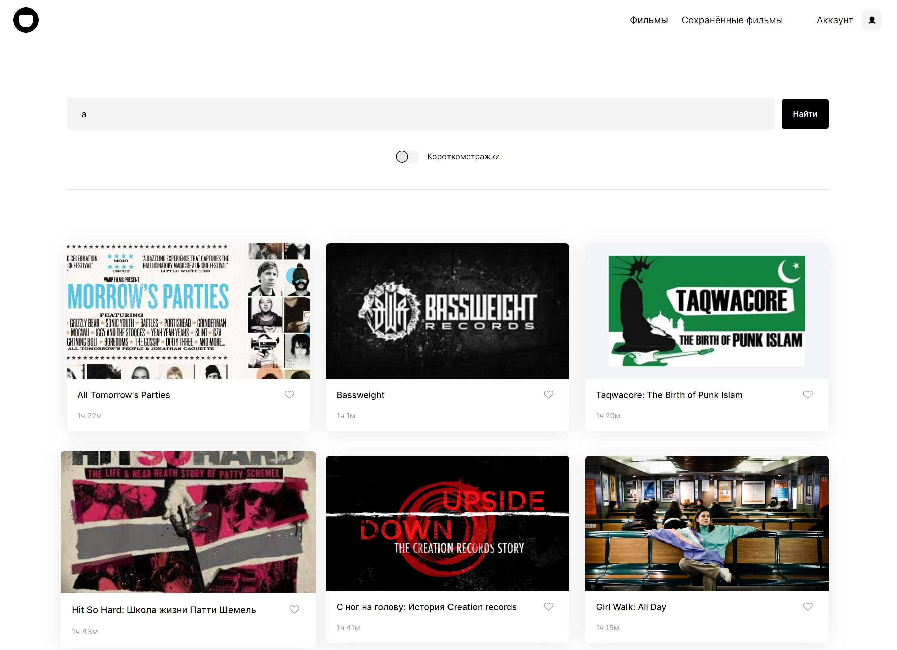

# Дипломный проект Movies (фронтенд)
📧  
[Доменное имя: movies.dariy-iva.nomoredomains.work](https://movies.dariy-iva.nomoredomains.work/)  
Публичный IP: 62.84.126.164

## О проекте

Фронтенд-часть проекта Movie - сервиса для поиска фильмов и их сохранения в личном кабинете.  

  

### Требования к проекту

✔ два состояния шапки - для авторизованного и неавторизованного пользователя  
✔ количество карточек с фильмами меняется в зависимости от ширины экрана пользователя, в т.ч. динамически (реализовано через кастомный хук, отслеживающий размер экрана)  
✔ при переходе по несуществующему пути пользователь попадает на страницу ошибки (реализовано через компонент PageNotFound)  
✔ валидация форм (реализовано через кастомный хук)  
✔ авторизация и регистрация пользователей (реализовано через компоненты Login и Register, глобальный стейт LoggedInContext, отправку запросов и проверку наличия токена из AuthApi.js)  
✔ редактирование профиля пользователя (реализовано через компонент Profile и отправку запросов из MainApi.js)  
✔ поиск фильмов по названию и длительности, запуск прелоадера на время обработки запроса, сохранение текста запроса, найденных фильмов и состояние переключателя в локальном хранилище - при повторном переходе на страницу фильмов данные достаются из локального хранилища (реализовано через компоненты SearchForm, Preloader и отправку запросов из MoviesApi.js)  
✔ сохранение и удаление сохраненных ранее фильмов (реализовано через компоненты Movies, SavedMovies и отправку запросов из MainApi.js)  
✔ уведомление пользователя об успешности/неуспешности запросов (реализовано через высплыающее модальное окно - компонент InfoTooltipPopup)  
✔ защита роутов при попадании неавторизованного пользователя на сайт, кроме роутов авторизации и регистрации (реализовано через компонент ProtectedRoute)  

✔ дополнительно реализовано (по усмотрению студента): 
 - возможность выхода из сеанса

### Стек:

* JS
* React
* HTML
* CSS
* JSX

## Директории

`/components` — папка с компонентами приложения (внутри каждой папки хранятся файлы JSX и CSS, относящиеся к компоненту)  
`/images` — папка с изображениями  
`/utils` - папка с файлами констант и настроек конфигурации  
`/vendor` - папка с кодом и файлами сторонних разработчиков (включая шрифты)  

## Установка зависимостей и запуск проекта

##### `npm i` – установить зависимости

##### `npm start` – запуск devServer на http://localhost:3000/

##### `npm run build` – production сборка проекта

Макет предоставлен: _Я.Практикум_.
